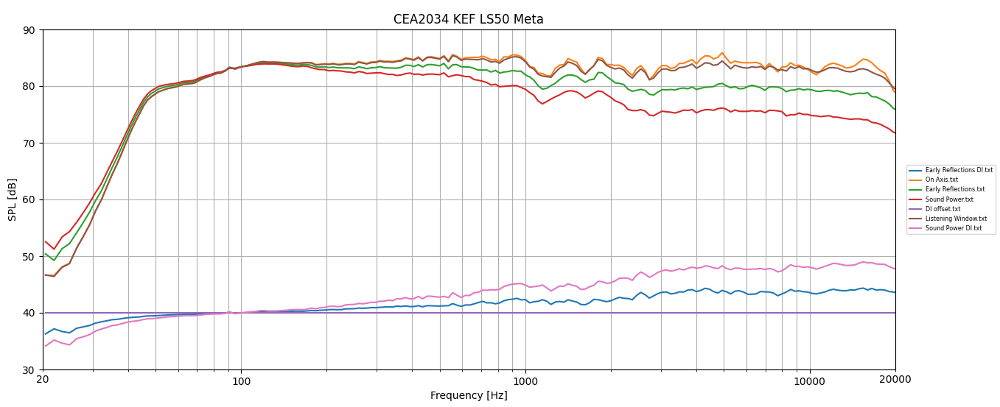
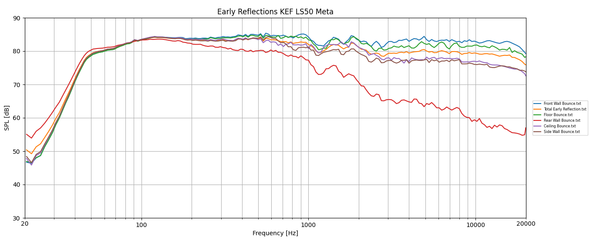
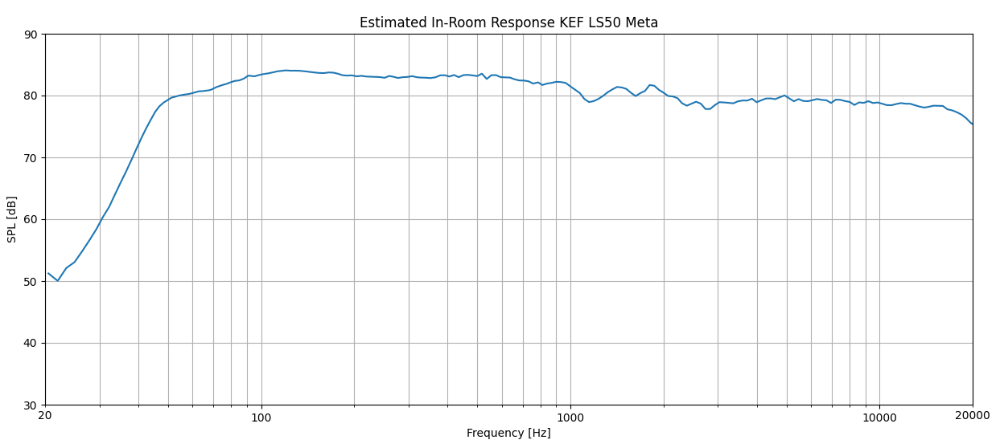
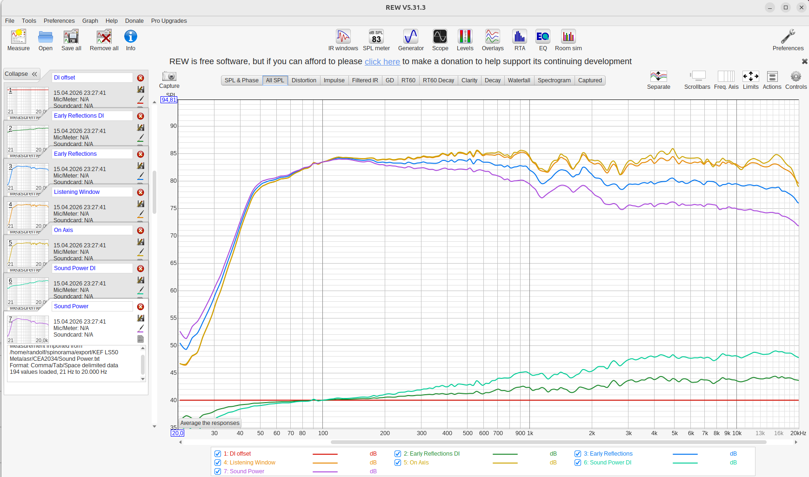
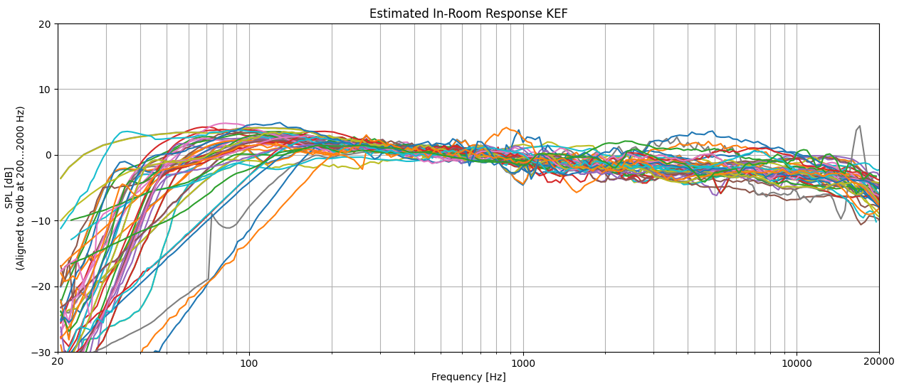
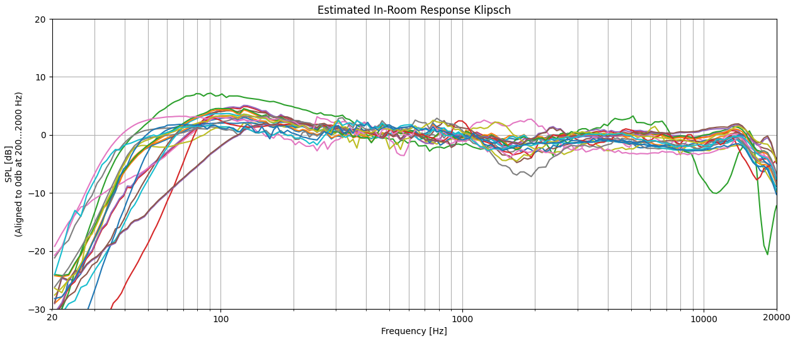

# ExportSpinoramaData
ExportSpinoramaData is a simple tool to export Spinorama data from [spinorama](https://github.com/pierreaubert/spinorama) (see also [SPINorma](https://www.spinorama.org/)) as CSV text textfiles. It uses the loudspeaker measurement database and APIs from [spinorama](https://github.com/pierreaubert/spinorama) and is written in [Python 3](https://www.python.org/). The [actual measurement data of spinorama](https://github.com/pierreaubert/spinorama/tree/develop/datas/measurements) comes from various providers (see [spinorama.org](https://www.spinorama.org/docs/06_sources.html)).

The expoted data (CEA2034, Early Refections and Estimated In-Room Response) can directly be imported into various tools, e.g. [REW](https://www.roomeqwizard.com/), [FreqRespGraph](https://github.com/rwhomeaudio/FreqRespGraph) or spreadsheet software for display and further processing.

# Installation
You need to install python, pip, git and most likely python venv first. After that you can clone the spinorama and ExportSpinoramaData git repositories, install the module dependencies and set PYTHONPATH.

## Example installation on Ubuntu 24.04
```
cd
sudo apt-get update
sudo apt install git
git clone https://github.com/pierreaubert/spinorama
sudo apt install imagemagick npm
sudo apt install python3-pip
sudo apt install python3.12-venv
python3 -m venv $HOME/venv
cd spinorama
$HOME/venv/bin/pip install -r requirements.txt
$HOME/venv/bin/pip install jupyterlab
$HOME/venv/bin/pip install altair
locale -a
sudo locale-gen en_US.UTF-8
cd
git clone https://github.com/rwhomeaudio/ExportSpinoramaData
```
## Example test run on Ubuntu 24.04
```
export PYTHONPATH=$HOME/spinorama/src:$HOME/spinorama/src/website:$HOME/spinorama
cd ExportSpinoramaData
$HOME/venv/bin/python ExportSpinoramaData.py -h
```
## Example installation on Windows
- Download and install Python 3.X on your system: [https://www.python.org/downloads/](https://www.python.org/downloads/).
- Install git command line client: [https://github.com/git-guides/install-git](https://github.com/git-guides/install-git)
- Because spinorama repository currently contains a few files with invalid pathnames containing ":" or "|" we currently cannot use "git clone https://github.com/pierreaubert/spinorama".
To workaround this download spinorama-develop.zip from [https://github.com/pierreaubert/spinorama](https://github.com/pierreaubert/spinorama) using "Code->Download ZIP" and extract it to %HOMEDRIVE%%HOMEPATH%\spinorama. Skip the reported files.
```
cd %HOMEDRIVE%%HOMEPATH%
cd spinorama
pip install -r requirements.txt
cd %HOMEDRIVE%%HOMEPATH%
git clone https://github.com/rwhomeaudio/ExportSpinoramaData
```
## Example test run on Windows
```
set PYTHONUTF8=1
set PYTHONPATH=%HOMEDRIVE%%HOMEPATH%/spinorama/src;%HOMEDRIVE%%HOMEPATH%/spinorama/src/website;%HOMEDRIVE%%HOMEPATH%/spinorama
cd ExportSpinoramaData
python ExportSpinoramaData.py -h
```
# Usage
```
ExportSpinoramaData.py -h
usage: ExportSpinoramaData [-h] [--absSPL] speaker version

ExportSpinoramaData exports spinorama data of a given speaker model and measurement version as text files in a sub directory "export".
The exported files can e.g. directly be imported in REW or spreadsheet programs.

positional arguments:
  speaker
  version

options:
  -h, --help  show this help message and exit
  --absSPL    Export data with absolute SPL instead of 0dB normalized, default off

Example:

  ExportSpinoramaData.py --absSPL "KEF LS50 Meta" "asr"

  creates

    export/KEF LS50 Meta/asr/CEA2034/All.csv
    export/KEF LS50 Meta/asr/CEA2034/Early Reflections DI.txt
    export/KEF LS50 Meta/asr/CEA2034/On Axis.txt
    export/KEF LS50 Meta/asr/CEA2034/Early Reflections.txt
    export/KEF LS50 Meta/asr/CEA2034/Sound Power.txt
    export/KEF LS50 Meta/asr/CEA2034/DI offset.txt
    export/KEF LS50 Meta/asr/CEA2034/Listening Window.txt
    export/KEF LS50 Meta/asr/CEA2034/Sound Power DI.txt
    export/KEF LS50 Meta/asr/Estimated In-Room Response.txt
    export/KEF LS50 Meta/asr/Early Reflections/Front Wall Bounce.txt
    export/KEF LS50 Meta/asr/Early Reflections/All.csv
    export/KEF LS50 Meta/asr/Early Reflections/Total Early Reflection.txt
    export/KEF LS50 Meta/asr/Early Reflections/Floor Bounce.txt
    export/KEF LS50 Meta/asr/Early Reflections/Rear Wall Bounce.txt
    export/KEF LS50 Meta/asr/Early Reflections/Ceiling Bounce.txt
    export/KEF LS50 Meta/asr/Early Reflections/Side Wall Bounce.txt

  from the measurement of the KEF LS50 Meta provided by Audio Science Review with absolute SPL.
  
  Use

  ExportSpinoramaData.py --absSPL '*' '*'

  to export all availabile measurements.

```

For convenience all currently available measurments are already exported to export directory of this repository, however to get the latetst measuremnts of [spinorama](https://github.com/pierreaubert/spinorama) you need to export it by your own.

# Examples

1. Display exported data of KEF LS50 Meta in FreqRespGraph.py:

`python $HOME/FreqRespGraph/FreqRespGraph.py --csvdelimiter " " --ymin 30 --ymax 90 --title "CEA2034 KEF LS50 Meta" --files "$HOME/ExportSpinoramaData/export/KEF LS50 Meta/asr/CEA2034/*.txt"`

`python $HOME/FreqRespGraph/FreqRespGraph.py --csvdelimiter " " --ymin 30 --ymax 90 --title "Early Reflections KEF LS50 Meta" --files "$HOME/ExportSpinoramaData/export/KEF LS50 Meta/asr/Early Reflections/*.txt"`

`python $HOME/FreqRespGraph/FreqRespGraph.py --csvdelimiter " " --ymin 30 --ymax 90 --nolegend --title "Estimated In-Room Response KEF LS50 Meta" --files "$HOME/ExportSpinoramaData/export/KEF LS50 Meta/asr/Estimated In-Room Response.txt"`


2. Display data of KEF LS50 Meta in REW (using: File->Import->Import frequency response):

3. Display estimated in-room response of all KEF and Klipsch measurements:
   
`python $HOME/FreqRespGraph/FreqRespGraph.py --csvdelimiter " " --alignmin 200 --alignmax 2000 --nolegend --title "Estimated In-Room Response KEF" --files "$HOME/ExportSpinoramaData/export/KEF*/*/Estimated In-Room Response.txt"`

`python $HOME/FreqRespGraph/FreqRespGraph.py --csvdelimiter " " --alignmin 200 --alignmax 2000 --nolegend --title "Estimated In-Room Response Klipsch" --files "$HOME/ExportSpinoramaData/export/Klipsch*/*/Estimated In-Room Response.txt"`

